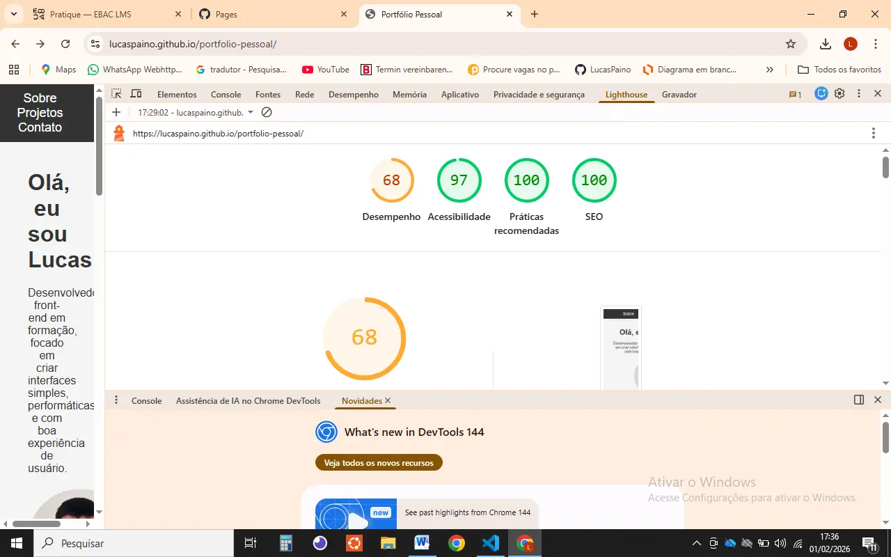
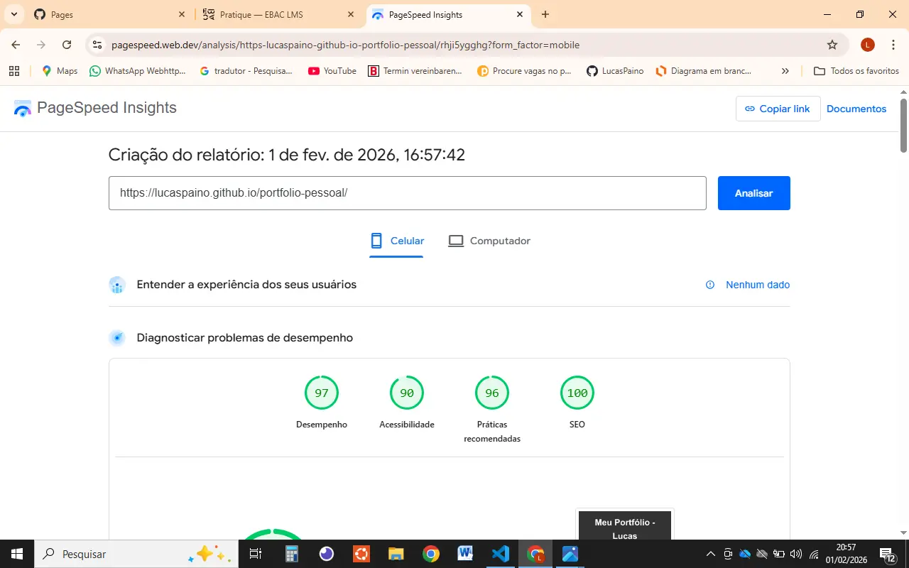

Portfólio Pessoal - Lucas

Este é o meu portfólio pessoal, que contém alguns dos projetos desenvolvidos durante o curso. O foco deste projeto foi otimizar o desempenho da página utilizando boas práticas de desenvolvimento e otimização para a web. O processo incluiu análise de desempenho, acessibilidade, práticas recomendadas e SEO, com o objetivo de melhorar a experiência do usuário e a pontuação nas ferramentas de análise.

Objetivo da Tarefa

O objetivo desta tarefa foi otimizar um projeto front-end já existente, melhorando o desempenho e a acessibilidade, além de aplicar boas práticas recomendadas e garantir um bom SEO. A análise foi realizada utilizando o Chrome DevTools (aba Performance e Lighthouse), com a aplicação das otimizações conforme recomendado.

Ferramentas Utilizadas

Chrome DevTools (Lighthouse)

PageSpeed Insights (para complementar a análise de desempenho)

GitHub Pages (para publicação do site)

Relatório de Desempenho

Durante a análise inicial, o site foi avaliado com base nos seguintes parâmetros:

Antes da Otimização:

Desempenho: 68

Acessibilidade: 97

Práticas recomendadas: 100

SEO: 100

Após a Otimização:

Desempenho: 97

Acessibilidade: 90

Práticas recomendadas: 96

SEO: 100

Gargalos Identificados

Imagens pesadas: Algumas imagens estavam em formatos não otimizados e não tinham o atributo loading="lazy".

JavaScript não minimizado: O código JavaScript estava sem minificação, o que aumentava o tempo de carregamento.

Código não utilizado: Algumas funções e imports estavam sendo carregados, mas não eram utilizados no código final.

Dependências externas: Algumas bibliotecas poderiam ser substituídas por versões mais leves.

Melhorias Aplicadas

Imagens:

Conversão para WebP/AVIF: As imagens foram otimizadas para os formatos WebP e AVIF, proporcionando uma melhor compressão sem perda significativa de qualidade.

Lazy Loading: Adicionado o atributo loading="lazy" nas imagens para garantir que elas carreguem apenas quando necessário.

JavaScript:

Minificação: O código JavaScript foi minificado, removendo espaços em branco, quebras de linha e outros caracteres desnecessários.

Remoção de código não utilizado: Funções e imports que não estavam sendo utilizados no código foram removidos.

CSS:

Minificação: O código CSS foi minificado para reduzir o tamanho do arquivo.

Remoção de regras não utilizadas: Regras de estilo que não estavam sendo aplicadas foram eliminadas.

HTML:

Minificação: O código HTML foi minificado para reduzir o tamanho do arquivo.

Comparativo Antes/Depois

Aqui estão os resultados de desempenho antes e depois das otimizações:

Parâmetro	              Antes	            Depois
Desempenho	               68	              97
Acessibilidade             97	              90
Práticas recomendadas	  100	              96
SEO	                      100	              100
Link para o Projeto

GitHub Pages: https://lucaspaino.github.io/portfolio-pessoal/

Conclusão

Com a aplicação dessas melhorias, conseguimos aumentar significativamente o desempenho do site, fazendo com que o tempo de carregamento fosse reduzido. Embora a acessibilidade tenha diminuído um pouco (devido à remoção de alguns scripts não utilizados), a otimização geral fez com que o site se tornasse mais rápido e eficiente. As melhorias também garantirão uma experiência de usuário mais fluida em dispositivos móveis e conexões mais lentas.

## Comparativo Antes/Depois

### Antes da Otimização

### Depois da Otimização

